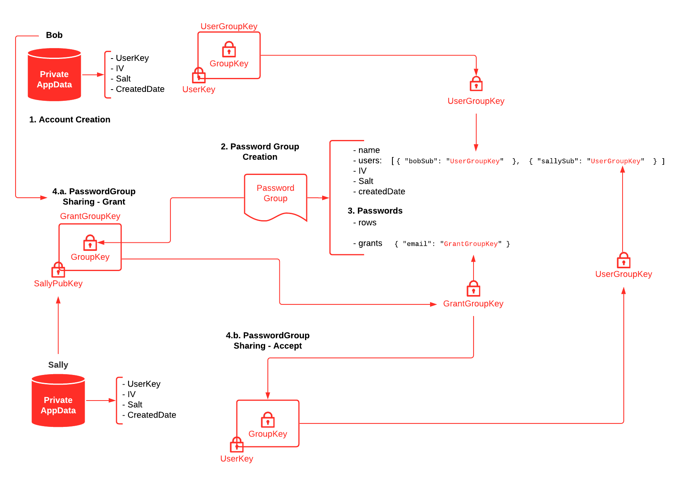

# Gnokey Password Manager

A simple Google Drive based password manager for startups/early-stage companies.

## Overview

1. The app authenticates with Google OAuth (client side flow) - *should enable 2FA for your account also to be on the safe side.
2. Use Google Drive private app data folder to store a JSON blob of user information (private key, etc.). NOTE: future iteration will use a split key stored on an external API to provide more security.
3. Encrypt passwords with Crypto JS AES (salt/iv stored along with the data in Drive) using the users private key.
4. Output the JSON data in rows that can be added/removed and easily copied.
5. Groups of passwords are shared using a browser based RSA key pub/priv key sharing mechanism.

The entire app is client side and stores nothing on a server, but is able to take advantage of Google Drive data storage (giving you access to your passwords in the cloud) while being encrypted in Drive at the same time!

## Contributing

1. `npm install & bower install`
2. use serve or just open /public/index.html
3. `gulp` will run tests, lint, compile browserify, compiles sass, and minify
4. serve on 8081 using `ws`

* Tests are run using `gulp-mocha-phantomjs` & `chai` and can be run command line or in the browser.
* All dependencies are loaded via Bower. Right now it is only Bootstrap (v4-alpha), jQuery & Crypto-JS.

## Deployment

Copy `/public` to s3 bucket.